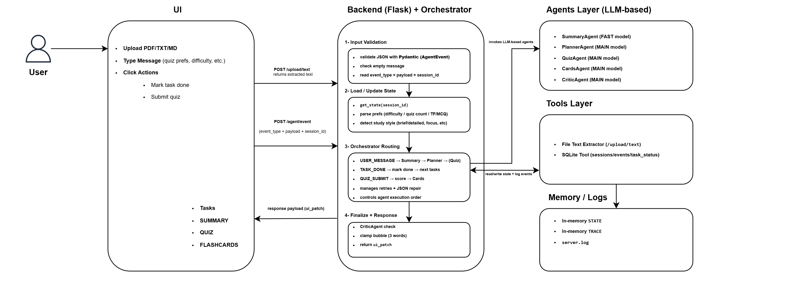
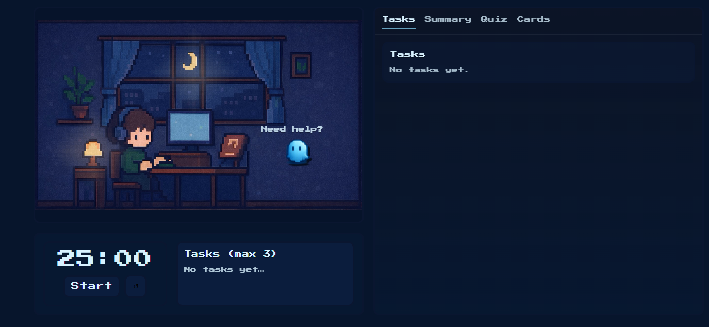
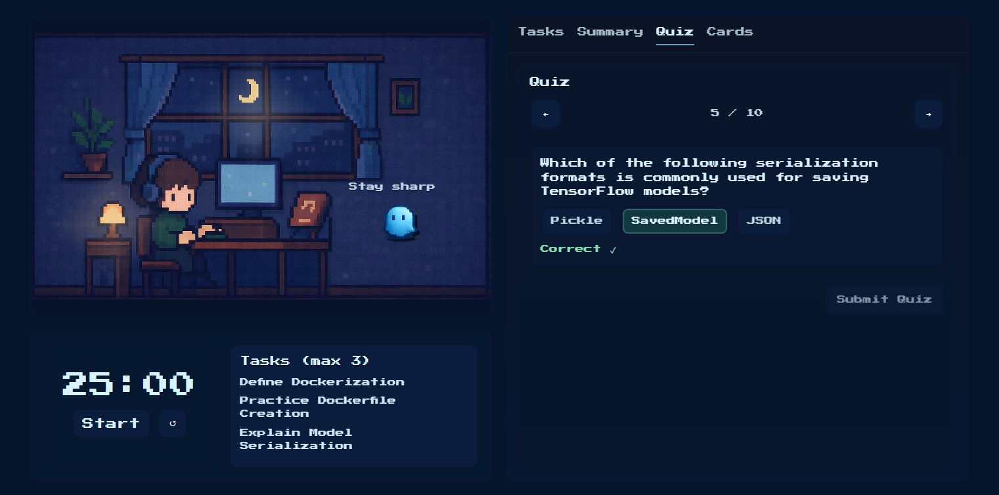

# 👻 Study Companion AI

**Developed** during the Tuwaiq Agentic AI Bootcamp (2026)

Study Companion AI is an AI-powered learning assistant designed to transform lecture materials into structured study sessions. Instead of manually creating notes and revision resources, the system uses multiple AI agents to analyze lecture content, generate concise summaries, build personalized study plans, create quizzes, and produce flashcards to support active learning.

The project demonstrates the integration of Large Language Models (LLMs), agent orchestration, prompt engineering, and backend services into a single educational workflow.

---

## 🏗️ System Architecture

The following architecture was designed during the initial development of the project and illustrates the interaction between the frontend, backend orchestrator, AI agents, tools, and persistence layer.

  

---

## ✨ Key Features

| Feature | Description |
|---------|-------------|
| 📄 Lecture Processing | Extracts and processes lecture content from PDF or text files. |
| 🧠 AI Summarization | Generates structured summaries highlighting key concepts and important information. |
| 📅 Study Planner | Creates personalized study tasks based on the uploaded lecture. |
| ❓ Quiz Generation | Produces multiple-choice and True/False questions for self-assessment. |
| 🃏 Flashcards | Generates memory cards to support active recall and long-term retention. |
| ⏱️ Pomodoro Timer | Encourages focused study sessions using the Pomodoro technique. |
| 💾 Session Persistence | Stores study sessions and progress using SQLite. |
| 🤖 Multi-Agent Workflow | Coordinates specialized AI agents through a Flask-based orchestration layer. |

---

## 📸 Interface Preview

### Dashboard

  

### AI-Generated Quiz

  

---

## 🧠 AI Agent Architecture

| Agent | Responsibility |
|--------|----------------|
| **Summary Agent** | Produces structured summaries from lecture content. |
| **Planner Agent** | Generates personalized study tasks and learning objectives. |
| **Quiz Agent** | Creates multiple-choice and True/False assessment questions. |
| **Cards Agent** | Generates flashcards for active recall practice. |
| **Critic Agent** | Reviews and validates generated responses before returning them to the user. |

---

## ⚙️ Tech Stack

| Layer | Technologies |
|------|--------------|
| Programming Language | Python |
| Backend | Flask |
| LLM | Google Gemini |
| AI Framework | LangChain |
| Validation | Pydantic |
| Database | SQLite |
| Frontend | React |
| Environment | python-dotenv |

---

## 📂 Repository Overview

This repository showcases the AI architecture, backend orchestration, and system design behind **Study Companion AI**.

This repository demonstrates:

• Multi-agent orchestration

• Modular Flask backend

• Prompt engineering workflow

• LLM integration

• System architecture

The frontend source code has intentionally been excluded to keep the repository focused on the AI components while preserving the original interface through screenshots.

